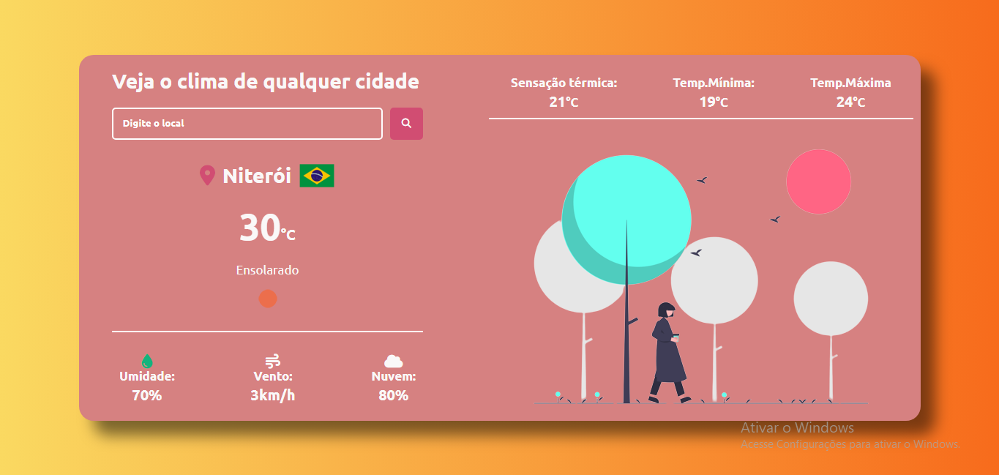

## API de clima ☀️

### Projeto feito com a API openweathermap

Feito para estudo de funções assíncronas e para aprender a chamar uma API com fetch entre outros métodos!

### Tecnologias 🚀 
- SASS
- HMTL
- JAVASCRIPT

### Design 🎨

### Projeto 🖥️

Acesse o projeto por esse link: <a href="https://gabriell0610.github.io/API-Clima/" target="_blank"> Projeto </a>

